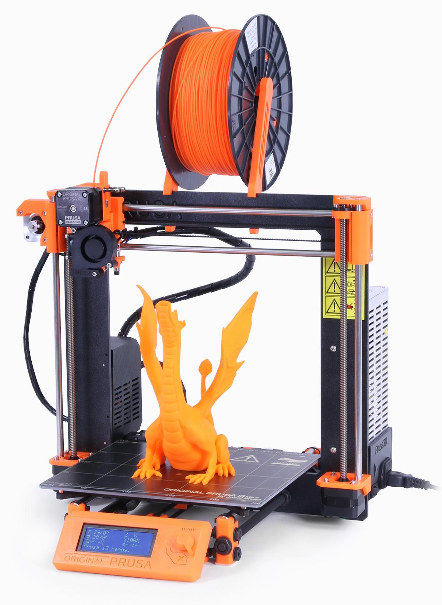
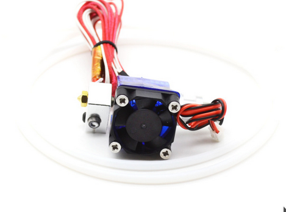
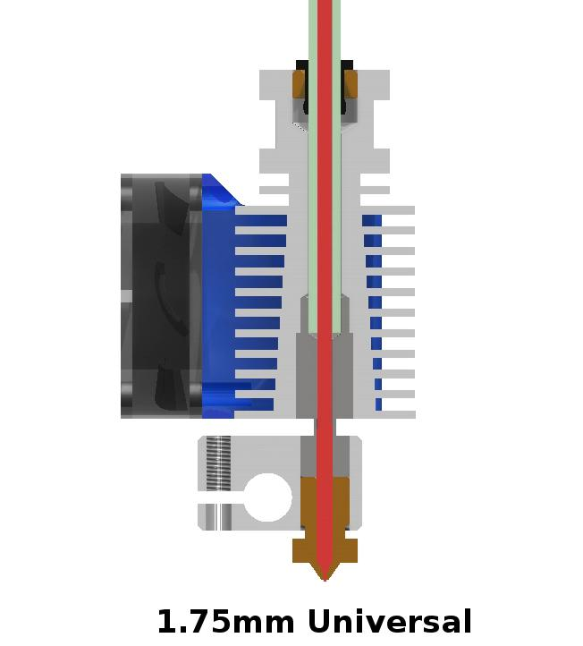
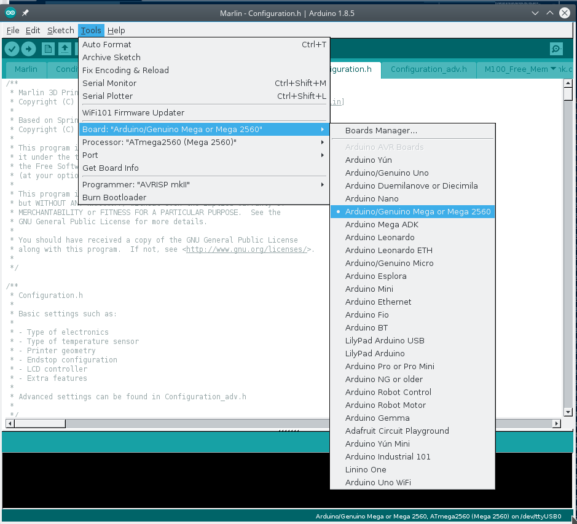

=====================================
On building a 3D printer from scratch
=====================================

Or How I spent this spring, summer, autumn and the stupid thing is still going
------------------------------------------------------------------------------

So the story started some time ago where I was looking to get into 3D printing, and I've been mercilessly exploiting/taking care of hacklab 3d printers, where I printer a phone car holder and a tabled holder (do you see a pattern here?)

3D printing workflow consists of getting any CAD design, converting it into a set of triangular meshes -- STL file, that converting that STL file into extruder movement commands that can be executed by a printer.

Think if using OpenOffice to write a document, then converting it to a PS file that gets sent to a printer to be executed.

In this talk I'm going to the opposite way, and at first show all the parts that make up a 3d printer, then the firmware that runs it, software that communicates with the said firmware, slicers that transform STL files into GCODE and finally CAD software that creates 3d objects.

I've been following Thomas Salandeerer channel toms3d on youtube, and at some point in february there was a featured series on how to build a 3D printer from scratch. So I thought to myself, why not?

TOM'S Guide
===========

Here are the videos:
Tom's guilde -- [CIT001]_ on building the cheapest possible prusa i3

These video series didn't come out of nowhere, it is based on one of more simpler and popular commercial 3d printers that are completely open-source -- Prusa i3 mk2

Prusa i3 mk2 is a part of reprap project build by Joe Prusa, based on Prusa Mendel which itself is based on Prusa Mendel,

Prusa i3 wiki -- [CIT002]_

.. [CIT001] Tom's 3d building cheapes prusa clone https://www.youtube.com/watch?v=oVWLpvekby0&index=1&list=PLDJMid0lOOYkdh8jCqIw7AFIHQiuKbSKZ
.. [CIT002] Prusa i3  wiki page https://en.wikipedia.org/wiki/Prusa_i3

Prusa i3 MK 2

Prusa Mendel i2

.. image:: images/002-prusa-mendel-i2.jpg
    :width: 200

Prusa Mendel

.. image:: images/003-prusa-mendel.jpg
    :width: 200

Prusa as a company has been around for a while and is committed to open-source design. They published printed part schematics on Github under GPL v2 in OpenSCAD, frame schematics SVG, software -- a Marlin fork and smoothie board for electronics. Stepper drivers situation is similar to the situation in computing in general, the chip hardware is closed source; the biggest players on the market

Prusa also publishes full assembly manual from nuts, bolts, printer parts and 3d-printer specific parts [CIT003]_

.. [CIT003] Original Prusa i3 MK2S kit assembly http://manual.prusa3d.com/c/Original_Prusa_i3_MK2S_kit_assembly

Allegro A4988 [CIT004]_
TI DRV8824 [CIT005]_
Trinamic TMC2100 [CIT006]_

.. [CIT004] -- http://www.allegromicro.com/en/Products/Motor-Driver-And-Interface-ICs/Bipolar-Stepper-Motor-Drivers/A4988.aspx
.. [CIT005] -- http://www.ti.com/product/DRV8825
.. [CIT006] -- https://www.trinamic.com/fileadmin/assets/Products/ICs_Documents/TMC2100_datasheet.pdf

Honorable mention -- Aleph objects, the makers of Lulzbot, even more hardcore than Prusa and release development files during every 15minutes during development.

######################
Starting out the build
######################

Ordering stuff from China:

There are several 3D printer specific parts and electronics needed:

Wiring Kit
==========

.. image:: images/parts/001-wiring-kit.jpg

To wire everything up, because you're really don't want to cramp and solder your own connection. Assembling a 3D printer takes up enough time alread

Stepper Drivers
===============

Basically transistors converting whatever is coming out of arduino into 12V/2A signal. For the purposes of doing the cheapest build use Allegros, they will work.

RAMPS
=====

.. image:: images/parts/005-ramps.png

The thing that connects arduino, steppers, wires motors and some fuses. This is an opensource design -- that's why it's possible to buy it from China for $5. There are attempts to 3D print this, that ended up with very mixed results.
I'm not an electronics person but I've been told that fuses are garbage and #2 cause of 3D printers catching on fire.

Inductive proximity probe
=========================

.. image:: images/parts/003-inductive-proximity-probe.png

This is used for aligning a nozzle relatively to the bed, on Z axis and automatic bed compensation. The line of thought goes -- instead of spending ours leveling the bed and adjusting nozzle height, the only thing that has to be precisely set in a 3D printer, do it in software.

Mechanical endstops
===================

The same thing but for X and Y axis, that don't need to be aligned. Basically mechanical switches..

Heated Bed
==========

If you want to print anything other than expensive PLA, this is for you. One of major annoying issues with FDM 3D printing is first layer adhesion. Theoretically it's possible to print without heated bed, but it's a world of pain, just get it, and this bed *Can* go to 105C.

This is an open source design that generally works and generally is pretty straight. The heated bed works with both 12V and 24V (with a slightly different wiring for each).

It's kind of silly to use a power supply to transform 110V AC to 12V DC to then just simply use that electricity for heating, and there are better solutions, like attaching a 110V silicone heater to an aluminium slab. But at $10 to $15 per piece nothing beats this solution that works well enough.

But buy a heated bed that's at least 3mm thick.

Power Supply
============

.. image:: images/parts/007-power-supply.png

This is a 12V 20A little power supply that could. It costs $20 with shipping and I'm surprise about several things about it:

  * that it worked at all
  * that it didn't catch on fire
  * heated bed alone bed draws 12A

If you're serious about building a 3D printer, you should get at least 30A power supply, or better yet 24V if you are willing to deal with 24V issues. But I would definitely recommend this to a friend.

Radial Fan
==========

Radial fan is need to print with PLA and PETG

Hobbed Gear
===========

.. image:: images/parts/009-hobbed-gear.png

Something that grabs fillamend and moves it to extruder. This designed is intended for makerbot, so extruder path needs to be modified slightly (with a drill) to accomodate for it. There are also specific designs in OpenScad that already account for this project (ardenpm)

Thermistor set
==============

This just gets stuck to the bottom of the bed or whenever I manage to damage a thermistor on a the extruder. More expensive ones are more precise and still can mesure higer temperatures, but the cheap ones generally work. There's a silicone insulater just next to the thermistor, so it could be attached to whatever hot part it's measuring.

For the hot bed the thermistors get attached with kapton tape. On E3D V6 hotend there's a screw that holds it in place.

Arduino mega knockoff
=====================

.. image:: images/parts/011-arduino-mega-knockoff.png

Or you can use genuine arduino mega. This underscores how many ideas for 3D printing were implemented in 1980s technology. Instead of figuring out a real-time system, a firmware was implement to work with bare hardware, arduino makes working with bare hardware easy.

Nema 17 steppers
================

Or just any stepper motors that fit profile. I bought these and then it turned out that the two leads in the middle are reversed. After figuring that out, I had to splice a wiring kit.

For this design 2X motors for Z axis, and one motor for each ,X axis, Y axis and extruder.

625 ball bearings
=================

.. image:: images/parts/013-625-ball-bearings.png

In the design one of this used to press filament against hobbed gear attached to an extruder motor, so the filament can be pushed through into heat zone.

Smooth rods
===========

.. image:: images/parts/014-smooth-rods.png

Parts that provide precision and rigidity for linear movements. I bought these on aliexpress for about $40 a set and they suck, and my printers are terrible. The linear rods came pre-bent, and these are one part of the 3D printer that needs to be precise.
ABS is sensitive to initial layer height, all plastic is, but ABS in particular. And if you ever want to print at all with ABS you need to straight rods.

I'm getting a much more expensive set from Misumi USA, a part of this built was figuring out where to get suppliers, and if there's only one thing I can express in this talk it's -- DONT BUY SMOOTH RODS ON Aliexpress.

GT2 Belt
========

This provides the precision of movement for X and Y axis. I bought polyurethane belt with steel threads first, and though it supposed to last longer it's stiffness makes it much harder to mount it on belt holders I highly recommend using rubber belts

GT2 Pulleys
===========

.. image:: images/parts/016-gt2-pulleys.png

The thing that tensions the beld on the opposite side of the motor that drives it. I used the one matching teeth count of a timing pulley. So far only one of them failed on me because I overtentioned the belt, then the bearing in the pulley failed.

M5 couplers
===========

Couplers that attach M5 rods (that drive Z axis) to stepper motors, in the previous iterations of the design aquarium hoses and zipties were used to attach M5 rods to motors. In the current version, Z lead screws and motors come as a single unit.

I tried replacing M5 threader rods with M8 Rods to increase Z-axis speed a bit and precision. That increased speed but precision got worse, in fact it cause the pronounced Z-wobble to appear on prints.

Threaded rods are just not precise for this application, and center of the rod moves as the rod turns, and while it's possible to get away with this using M5 (and as I read M6 rod), the bigger sizes of rods only will make this problem more pronounced.

Somewhat more expensive but much better solution is to use lead screws, that have 4 thres instead of one -- that ensures that as screw turns the center of the rod remains in the same place.

Timing Pulleys
==============

The thing that controls movement of X and Y axis that are pulled by GT2 belts. The fewer teeth the pulley has, the more torque and the better step precision, as motor rotation translates into level movements. I used 16-teeth pulleys, but 20-teeth pulleys are also available.

Linear Bearings
===============

.. image:: images/parts/019-lm8uu-linear-bearings.png

I've bought short and long really cheap bearings. After a while, about 100 hours of printing they get kind of loose, that especially noticeable on y axis assembly. If pressing down on a corner of a heated bed the whole bed moves in the opposite direction -- the bearings are too loose. This also may be caused by  zipties that hold them also get kind of loose.

I'm currently trying out linear bearings by MISUMI that are 5 times more expensive to see if they are making any difference.

Square Nuts
===========

.. image:: images/parts/020-square-nuts.png

M5 square nuts to be precise. These can't be find anywhere. I ended up ordering them from China.

Springs
=======

Springs are used to press down filament against a hobbed gear of the extruder with a 625 bearings. They don't undergo much stress and they generally work.

E3D V6 Knockoff
===============

This is a knock off of a E3D V6 hotend, since the original has been released under open-source license making a clone is kind of easy. Though the clones not as good as the original, machining is not precise and and J-throat that connects heater block to radiator is much thicker, meaning that melting zone is not as well defined as in the genuine part.

That being said genuine E3D V6 costs about $60, a knock-off ranges between $5 and $12.

Also cloned hot ends have a teflon liner inside of a heat break, that the liner effectively limits hotend temperature to 240C. With this limitation it is still possible to print PLA, ABS and PETG, but not Nylon.

A roll of Nylon
===============

3mm roll of nylon filament is used to provide rigidity for the wires that go to heated bed and extruder.

Cable wrap
==========

A nice way for cable management and to provide additional rigidity for the wires.

Flat board
==========

MDF or particle board. Home depot will helpfully cut any of their boards into

Zip ties
========

Lots of Zip Ties

###############
METRIC HARDWARE
###############

It was surprisingly difficult to find metric hardware at first, but then some of the industrial suppliers do sell their stuff to individuals and not corporations.

Disclaimer -- M8 and M10 rods that hold together Y axis can be replaced with their imperial counterparts, that would require adjusting affected 3D printed parts, or drilling/sanding.

M5 rods can't as imperial rods of the similar size would introduce bad Z-wobble.

Also technically M3 screws/nuts can be replaced, but then again things would get too tight and crack or be too loose and not hold things together, and again all the plastic parts designed for M3 screws/nuts/square nuts will need to be modified.

So Hardware. For one 3D printer

1X M10 1M Threaded Rod / M10 Nuts
1X M8 1M Threaded rod / M8 Nuts
1X M5 1M Treaded rod / Two M5 Nuts

Though latest model if Prusa i3 uses aluminum extrusions instead of M10 and M8 Rods.

Lots of zipties

(Cut the rods to pieces)

M3 Hardware
===========

10/12/16/18/20/25.30/40mm M3 Screws
Lots of M3 Nuts.

Suppliers -- I Acklands Grainger had all of the stuff, though for some reason M3x20 screws too forever to arrive (as in several months).

Printed parts
=============

Parts are available, and even modified for this particular build.

https://github.com/ardenpm/Original-Prusa-i3

So far the hardest part of the build was to print ABS without knowing how to properly print ABS. Parts need to be printend from ABS because of their temperature resistances and mechanical characteristics.

Fortunately since that requirement has been  established But there's a hack for that -- use PETG for all the parts but the extruder and print extruder parts with ABS. PETG is much easier to print, it's got a melting point of 70C which is enough for most applications, but the parts near extruder still need to be made out of ABS.

Assembling the printer
======================

The best part about this design that everything is so open-source, and there's the official step by step manual

http://manual.prusa3d.com/c/Original_Prusa_i3_MK2_kit_assembly

That goes over every axis, extruder and final assembly.

There's also Thomas Salanderer's 6-part series (it almost sounds like a documentary). Where he goes over that manuall assembling the printer.

https://www.youtube.com/watch?v=oVWLpvekby0&list=PLDJMid0lOOYkdh8jCqIw7AFIHQiuKbSKZ

Compiling firmware
==================

There are two open source 3D printing firmware projects that are currently active. Repetier and Marlin.

Since Marlin is the firmware used in the tutorial, so I just followed that.

Here's the fork that I'm using, all I've done is to customize Configuration.h (and Configuration_adv.h) with the parameters for the 3D printer I'm using.

mariln-1.15/mks-gen-1.4/Marlin/Configuration.h

These are the variables I'm using for Marlin 1.1.15, initially I started with 1.1.10rc4, and between the versions the variable naming changes so that I couldn't use the same Configuration.h file on a newer project, so I had to go over each sections and modify the variables manually. Fortunately there aren't that many section that need to be modified.

Relevant variables
------------------

Version of the firmware and who made the changes

Author/Version
==============

.. code-block:: C

    # define STRING_CONFIG_H_AUTHOR "(Alex Volkov, 2017 October 12)" // Who made the changes.

Maximum temperature of the heater, with teflon lining the resonable value would be 260C

Max Heater Temp
===============

.. code-block:: C

    #define HEATER_0_MAXTEMP 300

PID controller values for Heated  bed and Nozzle. PID(proportional-integral-derivative) is a closed loop controller for heating bed/nozlles, default values are fine for the initial runs, but later PID tuning should be used to make temperature control more precise.

Nozzle
======

.. code-block:: C

    #define  DEFAULT_Kp 9.13
    #define  DEFAULT_Ki 0.51
    #define  DEFAULT_Kd 40.61

Bed
====
.. code-block:: C

    //  M303 E-1 S95 C8
    // 24 V system  calibration
    #define  DEFAULT_bedKp 60.63
    #define  DEFAULT_bedKi 0.91
    #define  DEFAULT_bedKd 1013.15

Axis per unit setting
=====================

.. code-block:: C

    /**
     * Default Axis Steps Per Unit (steps/mm)
     * Override with M92
     *                                      X, Y, Z, E0 [, E1[, E2[, E3[, E4]]]]
     */
    #define DEFAULT_AXIS_STEPS_PER_UNIT   { 100, 100, 4000, 143 }

Axis per unit are used to determine how many micro steps need to move axis by 1mm

For X/Y/Z axis the values are derived based on how many steps per rotation a motor has 200/400 or how many degrees per step 1.8/0.9, the number of microsteps that motor driver is capable of 16/32 and belt pitch for X and Y axis, thread pitch for Z axis. Prusa calculator works for that

https://www.prusaprinters.org/calculator/

.. image:: images/005-prusa-calculator.png

Extruder however needs to be manually calibrated for how much filament it consumes -- that's the last value in the set.

Max feedrate
============

Basically the default speed of each axis and the extruder. The default values are a little high and it's nice to use conservative values as when feedrate is too high for a motor to handle it will lock up. I needed to decrease max feed rate for Z motors connected in parallel on a 12V system several times before they stopped randomly locking up.

.. code-block:: C

    #define DEFAULT_MAX_FEEDRATE          { 200, 200, 3, 25 }

Grid Points
===========

For mesh bed leveling -- which is a feature of this printer, it allows to compensate in software for unevenness of the bed which makes it much easier to align the bed and helps with adhesion of ABS.

This system however doesn't help at all when Y-axis rods are bent.

The optimal mesh is 4x4, making a bigger mesh doesn't necessarily help with more precise leveling.

.. code-block:: C

    #define GRID_MAX_POINTS_X 4
    #define GRID_MAX_POINTS_Y GRID_MAX_POINTS_X

Probing boundaries
==================

This section is mostly intended to set max probing points to prevent probe and/or nozzle from hitting one of the bed mounting points, but I've reduced these somewhat to compensate slightly for the horrible uneven smooth rods that screw up any kind of alignment.

.. code-block:: C

    #define LEFT_PROBE_BED_POSITION 30
    #define RIGHT_PROBE_BED_POSITION 180
    #define FRONT_PROBE_BED_POSITION 10
    #define BACK_PROBE_BED_POSITION 190

Minimum outer margin
====================

How far the probe can go before hitting other parts of the printer.

.. code-block:: C

    #define MIN_PROBE_EDGE 25

Probe Offset
============

Probe offset from the nozzle. There are also explanation on how to set this up on a multi-extruder system, but I haven't really bothered with that yet

.. code-block:: C

    #define X_PROBE_OFFSET_FROM_EXTRUDER 19  // X offset: -left  +right  [of the nozzle]
    #define Y_PROBE_OFFSET_FROM_EXTRUDER 10  // Y offset: -front +behind [the nozzle]
    #define Z_PROBE_OFFSET_FROM_EXTRUDER 0   // Z offset: -below +above  [the nozzle]
    // X and Y axis travel speed (mm/m) between probes
    #define XY_PROBE_SPEED 8000
    // Speed for the first approach when double-probing (with PROBE_DOUBLE_TOUCH)
    #define Z_PROBE_SPEED_FAST HOMING_FEEDRATE_Z
    // Speed for the "accurate" probe of each point
    #define Z_PROBE_SPEED_SLOW (Z_PROBE_SPEED_FAST / 2)

Compiling and uploading firmware
================================

The code can be edited with any editor, but the tool to upload it is Arduino editor.
Marlin firmware requires a more or less recent version of arduino, so the one in debian stable repository is too old, and the software should be download from the website. The current version is 1.8.5

Set the correct serial port (usually /dev/ttyUSB0)

Just select Tools -> Board  -> Adruino Genuino Mega / Mega 2560

Then click on Upload. Barring any communications issues that will upload the firmware onto the board.

First moves with the printer
============================

Using pronterface from printrun package.

This program connects to the printer and sends of Gcode commands, have a GUI interface to test print moves (that axis are moving in the right directions).

Turn the heaters on and off, execute gcode commands, and of course load and print gcode files.

Extruder calibration
====================

Take the cheapest spool of PLA that you have, insert it into the extruder and mark off 150mm. In Pronterface set extrusion length to 100mm, then set printer to extrude. When extrusion is finished measure the remaining length

Then using the formula (100/extruded_mm) * E1_steps_per_mm, get a new steps per MM value.

Go to adruino editor and adjust the value of DEFAULT_AXIS_STEPS_PER_UNIT, re-compile firmware and re-upload.

Re-calibrate extruder again make sure that correct amount of plastic has been extruded.

Different material may have different extrusion rates, so to skip re-compiling Marlin firmware, the value (100/extruded) mm can be entered in

Filament Settings tabe -> Filament -> Extrusion multiplier field

Nozzle height adjustment
========================

Nozzle height adjustment is critical for having successful print, especially for ABS -- the material most sensitive to precise bed position.

The nozzle adjustment works as follows:

Move nozzle to roughly the center of the bed

G0X107Y107

Move the inductive probe close to the bed. The sensing distance of LJ2A3-2-Z/AX-5V i 2mm. It's better to have the probe a bit closer initially to avoid the nozzle from hitting the bed.

Run G28Z command that does initial alignment, then run G0Z0 command that brings nozzle close to the bed.

Take a piece of paper and attempt to slide it in between the bed and the nozzle. If it's possible to slide it in, when the nozzle grabs onto the piece of paper, then bed leveling has been set.

Otherwise adjust the probe position relative to the nozzle position.

Bring probe closer to the bed if the nozzle is too close.

Move the probe away from the bed if nozzle doesn't touch the paper

Brief gcode primer
===================

G0 X100 Y100 Z100 E10 -- move extruder to a given point, while extruding 10mm of filament.
G1 X100 Y100 Z100 E10 -- do the same thing faster

G28X -- home X axis
G28Y -- home Y axis
G28Z -- home Z axis.

G29 -- perform mesh bed levelling

Initial Print
=============

This leads to using slicer and slicing software.

Available slicing software

Slic3r (Prusa edition) -- https://github.com/prusa3d/Slic3r/releases
Cura (Ultimaker)  -- https://ultimaker.com/en/products/cura-software/list
Simplify 3D (horribly proprietary)

Since I'm clonning Prusa i3 I went with Slic3r, also Prusa offers configuration files for their printer, that are also usable for any printer

Slic3r settings -- https://github.com/prusa3d/Slic3r-settings

What to print
=============

The best and most popular print so far is 3D Benchy, a little boat that will tell you a lot of information about print quality and possible problems.

.. image:: images/011-benchy.png

3D Benchy -- http://www.3dbenchy.com/

Settings that are OK for benchy is

Layers dialog
=============

Set shell 1 layer thick

Infil dialog
============

Set infill at 10%

Initialization startup code
============================

This leads to setting up printer initialization in slicer and slicing software.

.. code-block::

    # Homing
    G28 X; Home X axis
    G28 Y; Home Y axis
    ;Get the initial value from the center of the bed
    G0X107.5Y107.5 F3000; Move the bed so it's possible to home Z
    G28 Z; Z axis homing must be performed
    G29; mesh bed levelling
    G0X107.5Y107.5Z10; Move nozzle to the center to avoid damaging capton tape in case of Z axis misalignment

Shutdown gcode sequence
=======================

.. code-block::

    M104 S0 ; turn off hotend
    M140 S0; turn off heated bed
    G0X0Y210Z160 F2500; Move extruder away from the print & move print forward
    M84     ; disable motors

Setting up RPI, connecting and managing printer
===============================================

Octoprint is a distribution of raspbian that is made to control 3D printers with web interface that's pretty neat.

It charts tempertature settings, camera with some degree of control over axis , temperature and feedrate, live part printing progress preview (as it appears in gcode), and exposes terminal in the similar way that pronterface doe.

I tried raspberry Pi Zero but at the end switched to Raspberry Pi 3 because I wanted to have live camera feed (which is especially useful in heated chambers), and much faster boot times.

I'm not using a separate power supply and just running it from 2.5 Amp DC-DC buck converter, which so far seemed to be plenty.

There was nothing special about setting up Octoprint

I only needed to specify name, build volume number of extruders and nozzle diameter.

Octoprint Plugins
=================

Filament manager -- Measure how much filament has been used, to keep track if the spool has enough filament to finish the job
Navbar Temperature plugin -- just convenient
Print history -- success/failure print stats
Print stats
Telegram - communicate with printer using telegram chat client
Slic3r - slice on raspberry pi

Slicing software
================

Slic3r & Cura

Slic3r -- main branch haven't had a realease in a while.

Designing shapes in CAD
========================

TODO

Printing with different materials
=================================

TODO

Bed Adhesion issues with ABS

Printing issues
================

TODO: BENT RODS.

THE PLAGUE OF CHEAP HOMMADE PRINTER
When things work, things work quite nicely but when they don't it's a nightmare to figure out what's wrong.

Final steps of assembly
=======================

The biggest scare that I had during assembly was when I tried to move axis back and for and they didn't move because the motors wired weirdly. Everything else worked surprisingly well.

Several months after assembly I discovered that one of printer cables that I've used was bad. But by a lucky coincidence I didn't grab it out of the pile at that time.

