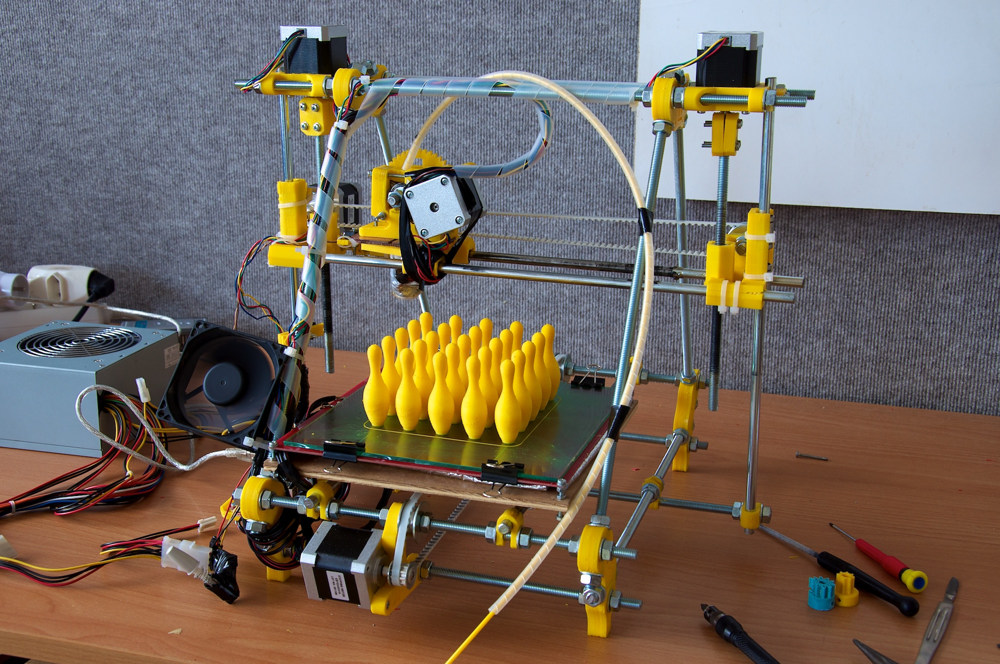
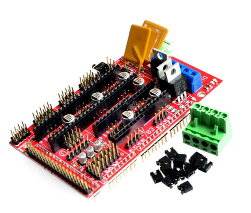
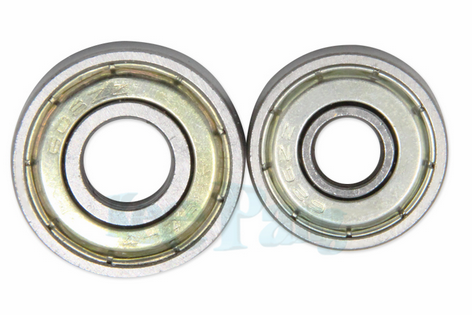
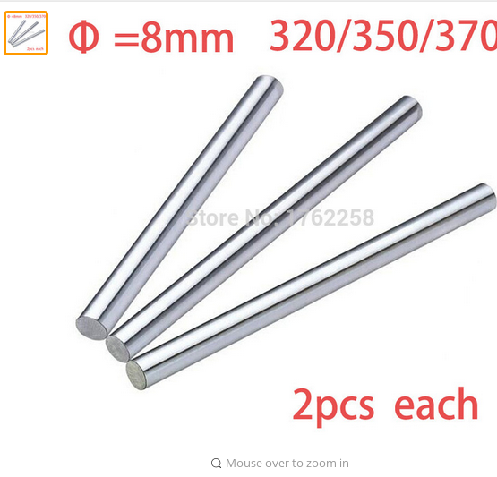
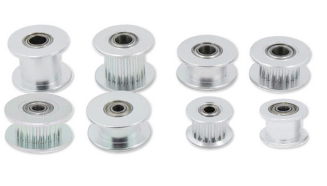
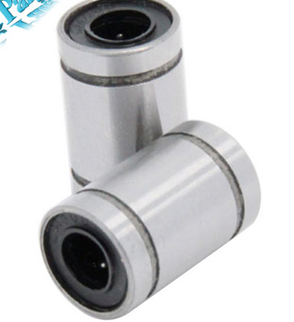
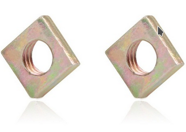
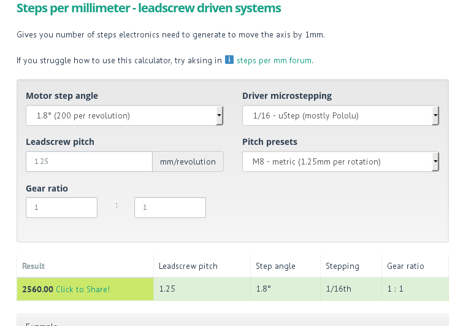
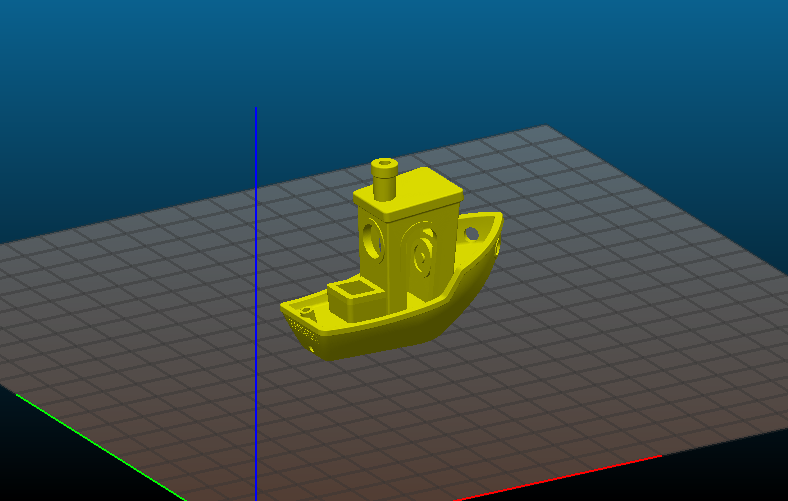

.. title: On building a 3D printer from scratch

----

On building a 3D printer from scratch
=====================================

Or How I spent this spring, summer, autumn and the stupid thing is still going.

----

TOM'S Guide
===========

Building the cheapest possible Prusa i3 MK2

Prusa i3 mk2 build manuals

----

Prusa i3 MK2
============

.. image:: images/001-prusa-i3-mk2.jpg
    :width: 400px

----

Prusa Mendel i2
===============

----

Prusa Mendel
============

.. image:: images/003-prusa-mendel.jpg
    :width: 400px

----

Starting the Build
===================

3D printer parts (from China, takes a while to get here)

Metric hardware (from China, different supplier, M3x20 screws take forever to get here)

MDF Board -- Home Depot

----

Wiring Kit
==========

.. image:: images/parts/001-wiring-kit.jpg

----

Stepper Drivers
===============

.. image:: images/parts/002-stepper-drivers.png

----

RAMPS
=====

----

Arduino mega knockoff
=====================

.. image:: images/parts/011-arduino-mega-knockoff.png

----

Inductive proximity probe
=========================

.. image:: images/parts/003-inductive-proximity-probe.png

----

Mechanical endstops
===================

.. image:: images/parts/004-mechanical-endstop.png

----

Heated Bed
==========

.. image:: images/parts/006-heated-bed.png

----

Power Supply
============

.. image:: images/parts/007-power-supply.png

----

Radial Fan
==========

.. image:: images/parts/008-rad-fan.png

----

Hobbed Gear
===========

.. image:: images/parts/009-hobbed-gear.png

----

Thermistor set
==============

.. image:: images/parts/010-thermistor-set.png

----

Nema 17 steppers
================

.. image:: images/parts/012-nema17hs4401-steppers.png

----

625 ball bearings
=================

----

Smooth rods
===========

----

GT2 Belt
========

.. image:: images/parts/015-gt2-cable.png

----

GT2 Pulleys
===========

----

M5 couplers / M5 Rods
=====================

.. image:: images/parts/017-m5-couplers.png

----

Timing Pulleys
==============

.. image:: images/parts/018-timing-pulley.png

----

Linear Bearings
===============

----

Square Nuts
===========

----

Springs
=======

.. image:: images/parts/021-1.2mm-5mm-20mm-springs.png

----

E3D V6 Knockoff
===============

.. image:: images/parts/022-e3d-v6.png

----

E3D V6 Cutaway
==============

.. image:: images/parts/023-e3dv6-cutaway.jpg

----

A roll of Nylon
===============

Hold the wires -- provide rigidity

----

Cable wrap
==========

Hold the wires -- wrap around

----

Flat board
==========

MDF or particle board.

----

Zip ties
========

Lots of zip ties.

----

Metric Hardware
================

Threaded rods for mounting a frame

M3 screws nuts to hold printer parts together

----

Rods
====

* 1X M10 1M Threaded Rod / M10 Nuts
* 1X M8 1M Threaded rod / M8 Nuts
* 1X M5 1M Treaded rod / Two M5 Nuts

----

M3 Hardware
===========
* 10/12/16/18/20/25.30/40mm M3 Screws
* Lots of M3 Nuts and washers

----

Suppliers
=========

Acklands Grainger

-----

Printed parts
=============

* Printing ABS is hard

* Everything except extruder parts can be printed with PETG

-----

Modified parts for the build
============================

https://github.com/ardenpm/Original-Prusa-i3

.. image:: images/008-extruder-cover.png

-----

PLA parts fail
==============

Assembling the printer
======================

* Prusa assembly manual -- http://manual.prusa3d.com/c/Original_Prusa_i3_MK2_kit_assembly

* Tom's guide -- https://www.youtube.com/watch?v=oVWLpvekby0&list=PLDJMid0lOOYkdh8jCqIw7AFIHQiuKbSKZ

-----

Compiling the firmaware
=======================

* Marlin -- https://github.com/MarlinFirmware/Marlin
* My presets -- https://github.com/avolkov/dolly-marlin
    * mariln-1.15/mks-gen-1.4/Marlin/Configuration.h
    * mariln-1.15/mks-gen-1.4/Marlin/Configuration_adv.h

----

Author/Version
==============

.. code-block:: C

    # define STRING_CONFIG_H_AUTHOR "(Alex Volkov, 2017 October 12)" // Who made the changes.

----

Max Heater Temp
===============

.. code-block:: C

    #define HEATER_0_MAXTEMP 300

----

Nozzle
======

.. code-block:: C

    #define  DEFAULT_Kp 9.13
    #define  DEFAULT_Ki 0.51
    #define  DEFAULT_Kd 40.61

----

Bed
====
.. code-block:: C

    //  M303 E-1 S95 C8
    // 24 V system  calibration
    #define  DEFAULT_bedKp 60.63
    #define  DEFAULT_bedKi 0.91
    #define  DEFAULT_bedKd 1013.15

----

Axis per unit setting
=====================

.. code-block:: C

    /**
     * Default Axis Steps Per Unit (steps/mm)
     * Override with M92
     *                                      X, Y, Z, E0 [, E1[, E2[, E3[, E4]]]]
     */
    #define DEFAULT_AXIS_STEPS_PER_UNIT   { 100, 100, 4000, 143 }

----

Max feedrate
============

.. code-block:: C

    #define DEFAULT_MAX_FEEDRATE          { 200, 200, 3, 25 }

----

Grid Points
===========

.. code-block:: C

    #define GRID_MAX_POINTS_X 4
    #define GRID_MAX_POINTS_Y GRID_MAX_POINTS_X

----

Probing boundaries
==================

.. code-block:: C

    #define LEFT_PROBE_BED_POSITION 30
    #define RIGHT_PROBE_BED_POSITION 180
    #define FRONT_PROBE_BED_POSITION 10
    #define BACK_PROBE_BED_POSITION 190

----

Minimum outer margin
====================

.. code-block:: C

    #define MIN_PROBE_EDGE 25

----

Probe Offset
============

.. code-block:: C

    #define X_PROBE_OFFSET_FROM_EXTRUDER 19  // X offset: -left  +right  [of the nozzle]
    #define Y_PROBE_OFFSET_FROM_EXTRUDER 10  // Y offset: -front +behind [the nozzle]
    #define Z_PROBE_OFFSET_FROM_EXTRUDER 0   // Z offset: -below +above  [the nozzle]
    // X and Y axis travel speed (mm/m) between probes
    #define XY_PROBE_SPEED 8000
    // Speed for the first approach when double-probing (with PROBE_DOUBLE_TOUCH)
    #define Z_PROBE_SPEED_FAST HOMING_FEEDRATE_Z
    // Speed for the "accurate" probe of each point
    #define Z_PROBE_SPEED_SLOW (Z_PROBE_SPEED_FAST / 2)

----

Compiling and uploading firmware
================================

.. image:: images/010-arduino-mega.png

----

First moves with the printer
============================

.. image:: images/009-pronterface.png

----

Extruder calibration
====================

* (100/extruded_mm) * E0_Steps_per_mm

* DEFAULT_AXIS_STEPS_PER_UNIT

* Filament Settings tab -> Filament -> Extrusion multiplier field

-----

Nozzle height adjustment
========================

* G0X107Y107

* G28Z

* The first time you print ABS and it doesn't fail, you will Know what is right

------

Brief Gcode Primer
==================

* G0 X100 Y100 Z100 E10 -- move extruder to a given point, while extruding 10mm of filament.
* G1 X100 Y100 Z100 E10 -- do the same thing faster

* G0 X100 Y100 Z100 F4000 -- set the speed

* G28X -- home X axis
* G28Y -- home Y axis
* G28Z -- home Z axis.

* Don't run G28

G29 -- perform mesh bed levelling

-----

Slicing
=======

Slic3r (Prusa edition) -- https://github.com/prusa3d/Slic3r/releases
Cura (Ultimaker)  -- https://ultimaker.com/en/products/cura-software/list
Simplify 3D (horribly proprietary)

Slic3r settings -- https://github.com/prusa3d/Slic3r-settings

----

Initialization startup code
============================

.. code-block::

    # Homing
    G28 X; Home X axis
    G28 Y; Home Y axis
    ;Get the initial value from the center of the bed
    G0X107.5Y107.5 F3000; Move the bed so it's possible to home Z
    G28 Z; Z axis homing must be performed
    G29; mesh bed levelling
    G0X107.5Y107.5Z10; Move nozzle to the center to avoid damaging capton tape in case of Z axis misalignment

----

Shutdown gcode sequence
=======================

.. code-block::

    M104 S0 ; turn off hotend
    M140 S0; turn off heated bed
    G0X0Y210Z160 F2500; Move extruder away from the print & move print forward
    M84     ; disable motors

----

What to print
=============

3D Benchy -- http://www.3dbenchy.com/

Settings:
    * 10% infill
    * 1 layer sides/top/bottom

----

Layers dialog
=============

.. image:: images/006-slic3r-layers.png

----

Infil dialog
============

.. image:: images/007-slic3r-infill.png

----

Octoprint!
==========

Octoprint
=========

* I prefer RPI 3
* Camera

----

Octoprint Plugins
=================

* Filament manager
* Navbar Temperature plugin
* Print history
* Print stats
* Telegram
* Slic3r

----

CAD Software
=============

* OpenSCAD

* TinkerCAD

* OnShape

* Autocad 360

----

Catalogs of existing designs
============================

* youmagine.com

* thingiverse.com -- weird licensing issues

* both host mostly STL files but some designs have parametrized designs for OpenScad/Autocad

Printing with different materials
=================================

See prusa3d/Slic3r-settings for material settings

----

PLA
===

Nozzle: 210C
Bed: 60C
Fan: On at 50%

Most popular material and is the cheapest

Nozzle temperature: 210C

Upsides:
    * can be found at $20 per 1KG spool
    * really easy to print
    * Biodegradable.
    * Possible to have transparent filament

Downsides:
    * Class transition at 60C
    * Doesn't really work with mechanical applications
    * Brittle

----

PETG
====

Almost as easy to print as PLA with much better mechanical properties. A  replacement for ABS.

Nozzle: 240C
Bed: 90C
Fan: On at 50%

Upsides:
    * Strong
    * Glass transition at 80C
    * Very strong, doesn't break but bents

Downsides:
    * Somewhat more expensive $30 -$35 per spool
    * Not as temperature resistant as ABS
    * Not as easy to print as PLA
    * Needs faster retract settings
    * Some stringing during printing

----

ABS
===

Really good material to work with, if you can print it in the first place.

Nozzle: 240C
Bed: 100C
Fan: Either off or at 10% depending on material

Upsides:

    * Strong
    * Glass transition at 105C
    * a 1kg spool can be found for $20 - $25
    * Easy to drill
    * Easy to cut
    * Dissolvable in acetone

Downsides
    * Hard to Print
    * First layer adhesion issues (needs a good printer with straight smooth rods)
    * Edge curling during print
    * Layer bonding issues (heated chamber is highly recommended)
    * Slower Print speeds

----

Printing Issues
===============

* ABS is kind of a pain

* My printer is less reliable and more finicky than its originator.

----

* Have a printing issue I don't know how to fix, replaced:
    * Parts of the nozzle
    * Motor mounts for Z axis
    * Y axis belt holder
    * Hardware holding heated bed.

----

* Going to replace:
    * Smooth rods
    * Hotend
    * Try different extruder motor

* Zipties on Y Axis are getting loose all the time

----

 * Sometimes everything works properly, other times I can't get printer to print anything in ABS -- Reliability.

 * Bed leveling issues.

----

Use big roll of kapton tape to improve bad adhesion.  Kind of old school.

Upsides:
    * Work most of the time
    * Doesn't need any additional adjustment \w inductive probe
    * Thin
    * I've been printing for 5 months I still have plenty of roll left

Biggest downsides:

    * Kind of pain to apply
    * Misaligned nozle will damage the surface
    * Kind of expensive
